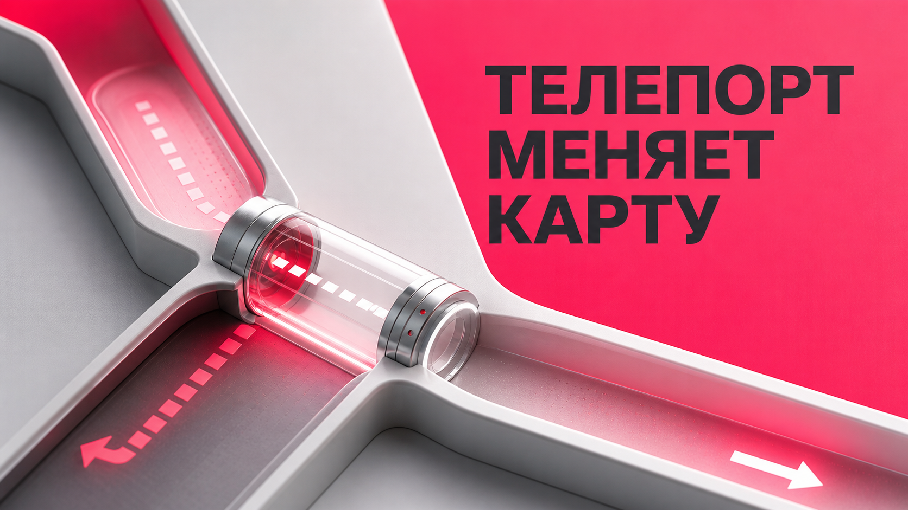
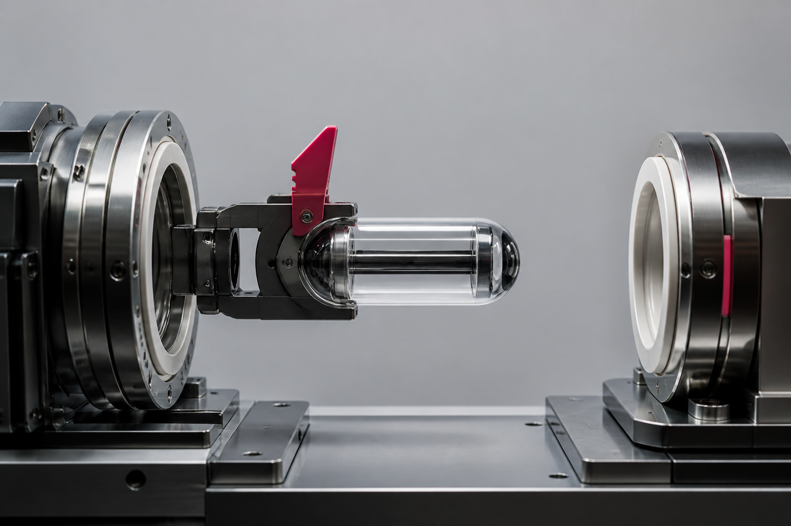

# Телепорт в Dota 2: как одно перемещение меняет три линии

Телепорт в Dota 2 начинается в одной точке, но решение по нему приходится принимать всей карте. Враг исчез с линии — и большинство сразу смотрит туда, где он должен появиться. Полезнее задать три вопроса: что герой оставил без давления, какой участок усилил и где теперь можно играть смелее.

<figure><figcaption></figcaption></figure>

Так чтение карты Dota 2 превращает эффект перемещения в связку последствий. Направление важнее самого визуального шума. При этом начатое действие ещё не доказывает прибытие, а свежая отметка не подтверждает, что герой останется в точке назначения.

### Телепорт начинается в одной точке, а меняет всю карту

Карта напоминает систему сообщающихся сосудов. Если герой быстро переместился к одной линии, он перестал занимать прежнюю. Его присутствие усилило новую зону, а нейтральный участок — лес, проход или объект — получил другой уровень риска.

Допустим, соперник начинает защитный TP к башне. Игроки рядом с точкой прибытия должны пересчитать численность и решить, есть ли смысл продолжать давление. Союзник на покинутой линии получает короткое окно, чтобы приблизить волну или нанести урон строению. Третья группа может быстрее занять свободный проход, но только если оставшиеся враги не способны наказать такой шаг.

Одна отметка не выдаёт готовый колл. Она обновляет условия для нескольких решений. Команда, которая видит лишь усиленную линию, замечает угрозу. Команда, которая одновременно перечитывает оставленную и нейтральную зоны, находит обмен. Даже если захватить ничего нельзя, соперника можно заставить потратить время на возврат или оставить ему неудобную волну. Это тоже практический результат замеченного перемещения.

### Точка отправления говорит не меньше точки прибытия

Вопрос «куда телепортируется враг Dota 2» полезен, но неполон. Нужно знать, откуда он ушёл. Именно место отправления показывает, какое давление исчезло и что сопернику пришлось бросить ради нового участка.

Если герой покидает длинную линию с подходящей волной, у его оппонента может появиться пространство. Если он уходит из зоны около важного прохода, меняется безопасность перемещения через этот проход. Если отправление произошло из-под угрозы, сам TP мог быть отступлением, а не подготовкой нападения.

Точка назначения отвечает на вопрос о новой силе. Точка отправления — о новой слабости. Только вместе они объясняют цену перемещения. Такой подход защищает от типичной ошибки: всей командой отступить от одного прибывшего героя и ничего не забрать на участке, который он только что освободил.

### Три линии, которые нужно перечитать за несколько секунд

После замеченного перемещения разделите карту на три зоны.

1. **Покинутая линия.** Кто остался её защищать? Есть ли волна, которую можно безопасно ускорить? Не исчезло ли главное ограничение для вашего героя?
2. **Усиленная линия.** Сколько противников теперь могут участвовать в эпизоде? Нужно ли отходить немедленно или достаточно прекратить агрессивный заход?
3. **Нейтральная зона или объект.** Изменился ли путь к руне, лесному участку или другому месту интереса? Может ли команда обменять давление на позицию?

Представим присоединение к драке. Один соперник уходит с верхней линии и направляется к столкновению внизу. Нижняя группа получает сигнал не затягивать спорный эпизод. Верхний герой может продавить волну. Игрок в центре не обязан бежать на помощь: иногда его лучший вклад — занять пространство, из которого ушёл враг.

Перемещение по линиям Dota 2 выгодно тому, кто считает не только прибывших, но и отсутствующих. Перед коллом полезно коротко назвать союзникам обе стороны обмена: «он ушёл сверху, он направляется вниз». Такая формулировка быстрее превращается в два локальных решения и не требует длинного объяснения во время драки.

### Начатый телепорт не равен завершённому

<figure><figcaption></figcaption></figure>

Три сигнала нельзя смешивать: герой начал действие, выбрал направление и действительно оказался в новой точке. Между ними состояние способно измениться. Перемещение может быть отменено, а наблюдаемая сцена — закончиться иначе, чем ожидалось.

В вымышленном эпизоде соперник начинает Town Portal Scroll с линии, и ваша команда сразу идёт вперёд на другом краю карты. Действие не завершается. Герой остаётся рядом с прежней зоной, а агрессивный колл уже построен на его отсутствии. Ошибка возникла не из-за нехватки реакции, а из-за слишком ранней уверенности.

Поэтому интерфейс и коммуникация должны различать отправление, направление и подтверждённое прибытие. Фраза «он начал TP вниз» точнее, чем «он уже внизу». Одно дополнительное слово сохраняет неопределённость, которая пока существует в матче.

### Когда информация свежая, но вывод уже неверный

Даже завершённый телепорт быстро стареет как сигнал. После прибытия герой может сменить маршрут, уйти за союзником, вернуться к фарму или покинуть видимую область. Если команда продолжает представлять его у точки назначения, свежая информация превращается в неверную модель.

Срок полезности зависит не от абстрактного числа секунд, а от последующих подтверждений. Был ли герой снова замечен? Есть ли у него причина оставаться? Сохранилась ли волна или цель, ради которой он прибыл? Каждый новый факт либо поддерживает первоначальный вывод, либо ослабляет его.

Особенно опасна яркая отметка без понятного срока жизни. Она может психологически весить больше, чем нормальные сигналы карты. Игрок начинает избегать зоны из-за старого события, хотя соперник давно покинул её. Хорошая информация должна уметь исчезать из внимания. В командной речи действует тот же принцип: старый колл надо явно отменить, иначе союзники продолжат строить решения вокруг уже несуществующей позиции врага.

### Четыре нормальные реакции команды

Замеченный TP не означает «обязаны драться». У команды есть минимум четыре разумных ответа.

* **Продавить оставленную линию.** Подходит, если главный ограничивающий герой ушёл, а оставшаяся защита не наказывает продвижение.
* **Отступить от усиленной.** Нужен, когда прибытие меняет численность или лишает вашу группу пространства для безопасного продолжения.
* **Ускорить объект.** Возможен, если перемещение отвело угрозу от нейтральной зоны и у команды уже есть позиция.
* **Сохранить место и обновить сведения.** Иногда лучший ответ — не менять план до подтверждения прибытия или следующего движения героя.

Ни одна реакция не универсальна. Защитный TP к башне может дать окно на другой линии, но оставшиеся соперники всё ещё способны организовать ответ. Присоединение к драке может потребовать отхода, а может сделать свободным более ценный участок. Решение строится из численности, волн, видимости и ближайшей цели.

### Каким должен быть полезный Teleport Preview

На странице [dota 2 cheats](https://melonity.gg/) Teleport Preview заявлен как отдельный информационный инструмент; оценивать его стоит по тому, различает ли он отправление, назначение и отмену, а не по яркости отметки.

При проверке такого интерфейса важны пять качеств:

1. Отправление и назначение читаются как разные точки, а не сливаются в один эффект.
2. Отмена имеет отдельное, спокойное состояние и не выглядит как завершённое прибытие.
3. Сигнал живёт ровно столько, сколько помогает решению, а затем теряет визуальный вес.
4. Цветовая иерархия показывает важность, но не перекрывает миникарту, героев и обычные эффекты.
5. Неопределённость видна пользователю: предполагаемое направление не маскируется под подтверждённый результат.

Название функции и её доступность — факты конкретного дня публикации. Их стоит перепроверять на целевой странице. Главное сравнение остаётся устойчивым: помогает ли визуал ответить на три вопроса о начале, направлении и завершении, не создавая ложной уверенности.

### Упражнение для реплея без дополнительных инструментов

Откройте обычный реплей и найдите момент, когда заметен старт телепорта. Остановите запись. Запишите три изменившиеся зоны: покинутая линия, предполагаемое место прибытия и нейтральный участок, где риск мог снизиться или вырасти.

Затем сформулируйте одно решение для своей команды. Например: прекратить давление внизу, приблизить верхнюю волну или сохранить позицию до подтверждения. Досмотрите следующие десять–пятнадцать секунд и сравните модель с реальным движением героев. Этот отрезок — формат упражнения, а не заявление о точной длительности механики.

Проверьте три вещи: завершилось ли перемещение, остался ли герой у назначения и использовал ли кто-нибудь освободившуюся зону. Через несколько эпизодов станет видно, где вы ошибаетесь чаще — игнорируете отправление, преждевременно подтверждаете прибытие или слишком долго держите старый сигнал в голове.

### FAQ

#### Что можно понять по телепорту врага в Dota 2?

Можно определить, откуда ушёл герой, куда он предположительно направился и какое давление изменилось на карте. Точный дальнейший план по одному TP доказать нельзя.

#### Почему точка отправления так же важна, как назначение?

Она показывает освобождённую линию или зону и цену, которую соперник заплатил за перемещение. Без неё команда видит новую угрозу, но пропускает возникшую возможность.

#### Может ли начатый телепорт быть отменён?

Начало действия не следует считать подтверждением прибытия. Нужно сохранять разницу между стартом, направлением и фактическим появлением героя в новой точке.

#### Когда информация о TP становится устаревшей?

Когда герой меняет маршрут после прибытия, покидает точку или новые наблюдения противоречат прежнему выводу. Сигнал следует обновлять, а не хранить до конца следующего эпизода.

#### Как тренировать чтение телепортов по реплеям?

Ставьте паузу в момент начала, называйте три затронутые зоны и прогнозируйте одно командное решение. Затем досматривайте короткий эпизод и проверяйте не только прибытие, но и использование освобождённой части карты.

После каждого замеченного TP называйте вслух не героя, а освободившийся участок карты.
